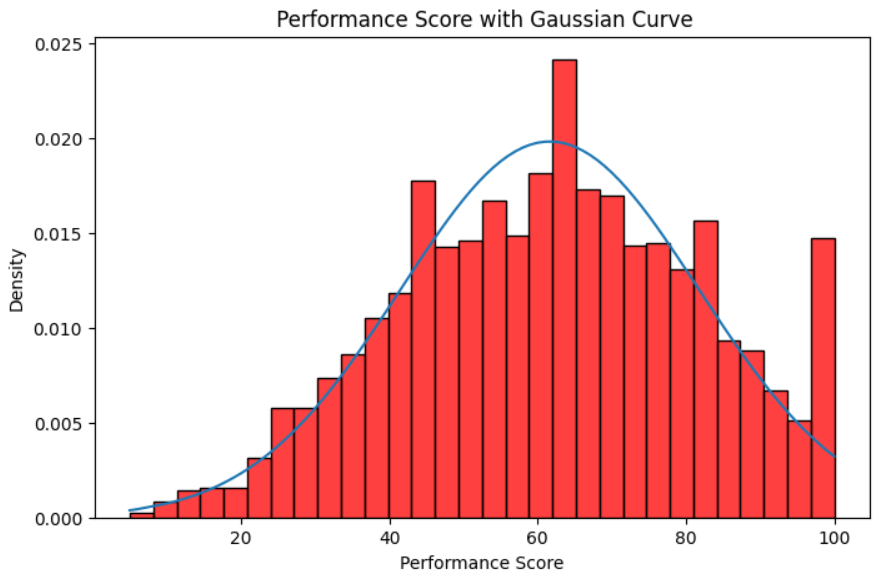
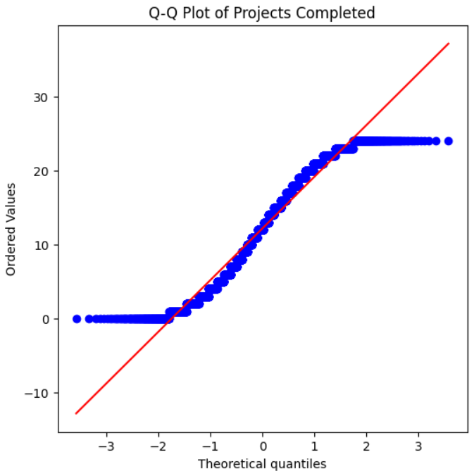

# 📊 Employee Performance Analysis & Statistical Decision Making

## 🧾 Project Overview
This project focuses on analyzing **employee performance data** using statistical concepts and Python-based analysis.  
The aim of the project is to understand employee productivity, salary patterns, working hours, and promotion probabilities using descriptive statistics and data analysis techniques.

# 🎯 Project Objective

The main objectives of this project are:

- Understand statistical concepts such as **Mean, Median, Mode**
- Analyze employee data using **Python**
- Explore **employee performance patterns**
- Understand **probability and promotion chances**
- Apply **PCA (Principal Component Analysis)** for dimensionality reduction

This project demonstrates how statistical analysis can support **data-driven decision making in organizations**.

# 📊 Dataset Description

The dataset contains approximately **4000 employee records** with the following fields:

| Column | Description |
|------|-------------|
| Employee_ID | Unique identifier for employees |
| Department | Department of employee |
| Age | Age of employee |
| Salary | Salary of employee |
| Projects_Completed | Number of completed projects |
| Working_Hours | Average working hours |
| Performance_Score | Performance rating (0–100) |
| Promotion_Status | Promotion eligibility (Yes/No) |

---

# 📘 Part A – Statistical Theory

The following statistical concepts were explained in this project:

### Mean, Median, Mode
Measures used to understand the **central tendency of salary distribution**.

### Range vs Variance
Range measures spread using minimum and maximum values, while variance measures how far data values deviate from the mean.

### Normal Distribution vs Poisson Distribution
Normal distribution represents continuous symmetrical data, whereas Poisson distribution models event occurrences over time.

### Skewness
Skewness measures asymmetry in data distribution.

### Conditional Probability
Conditional probability explains the likelihood of promotion given certain employee characteristics.

### Independent vs Mutually Exclusive Events
Independent events do not affect each other, while mutually exclusive events cannot occur simultaneously.

### Bayes Theorem
Bayes theorem helps update probability based on new evidence.

### Principal Component Analysis (PCA)
PCA reduces dataset dimensions while preserving maximum variance.

---

# 🔬 Data Analysis (Python Implementation)

All analysis is implemented in **Practical_exam.ipynb**.

### Steps Performed:

✔ Data loading and preprocessing  
✔ Statistical summary of employee data  
✔ Salary and performance distribution analysis  
✔ Promotion probability analysis  
✔ Visualization using charts  
✔ PCA for dimensionality reduction  

---

# 📈 Key Insights

Some insights derived from the analysis:

- Employees with higher **performance scores** tend to have higher promotion chances.
- Salary distribution shows **moderate variance across departments**.
- Working hours and projects completed influence employee performance.
- PCA helps identify the most important features affecting performance.

---

# 📷 Project Screenshots

### Data Analysis Visualization

- 

- 
---

# 🛠 Technologies Used

- Python
- Pandas
- NumPy
- Matplotlib
- Seaborn
- Scikit-Learn
- Jupyter Notebook

---

# 📊 Learning Outcomes

From this project we learned:

✔ Statistical analysis of employee data  
✔ Application of probability concepts  
✔ Python-based data analysis workflow  
✔ Dimensionality reduction using PCA  
✔ Visualization and interpretation of results  

These techniques are widely used in **HR analytics, business intelligence, and data science**.

---

# 📌 Conclusion

This project demonstrates how statistical methods and data analysis techniques can be used to understand employee performance patterns and promotion probabilities.  

By combining **statistical theory with practical Python implementation**, we gain valuable insights that can help organizations make informed decisions regarding employee management and productivity.

---

# 👨‍💻 Author

Janki Dholariya

